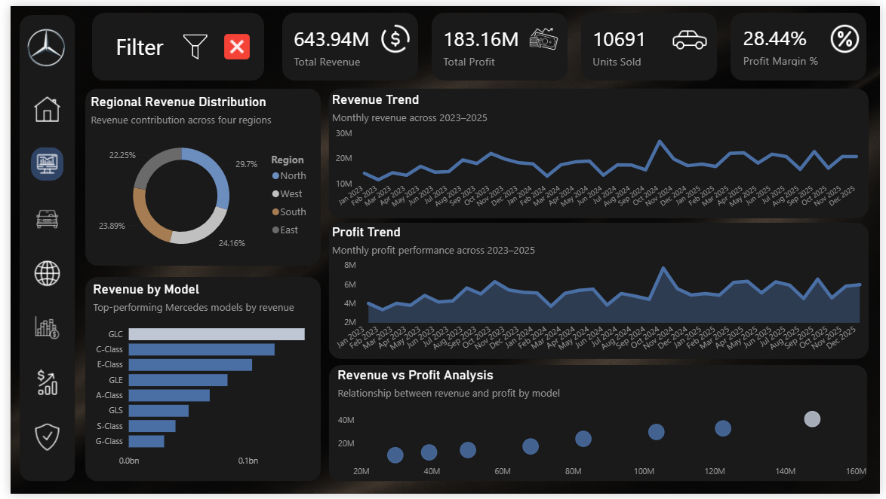
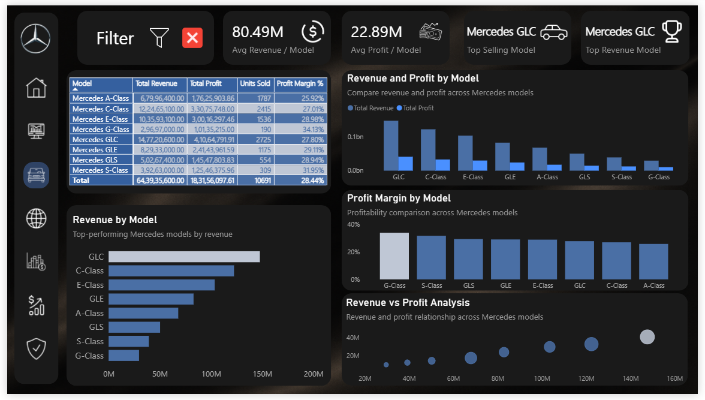
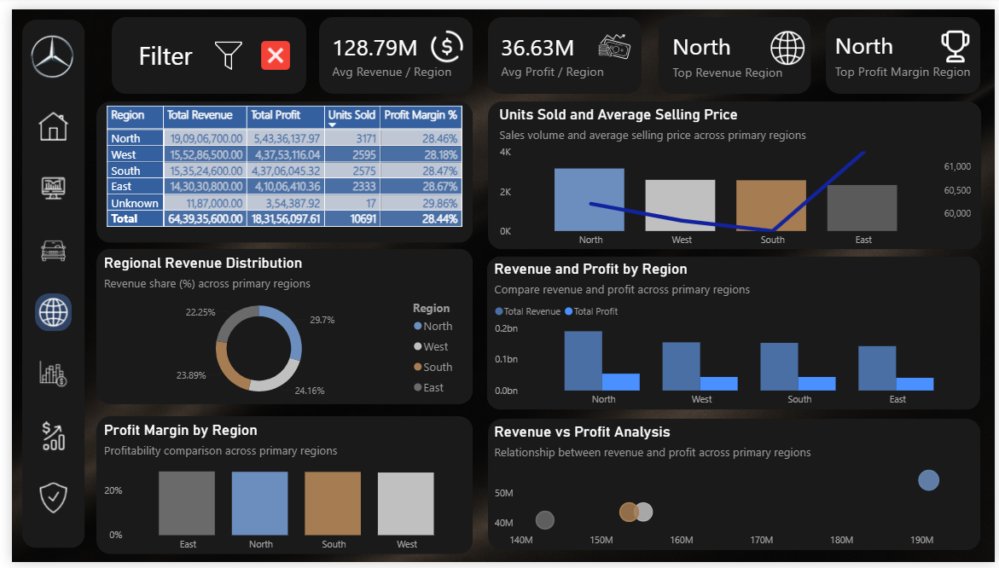
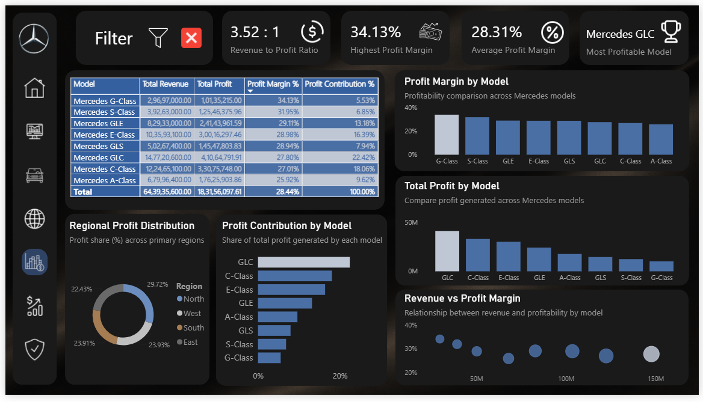
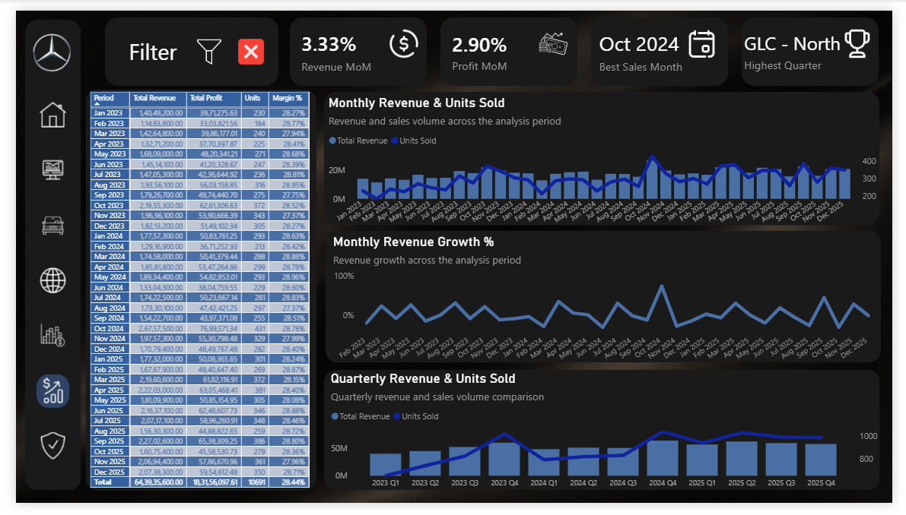
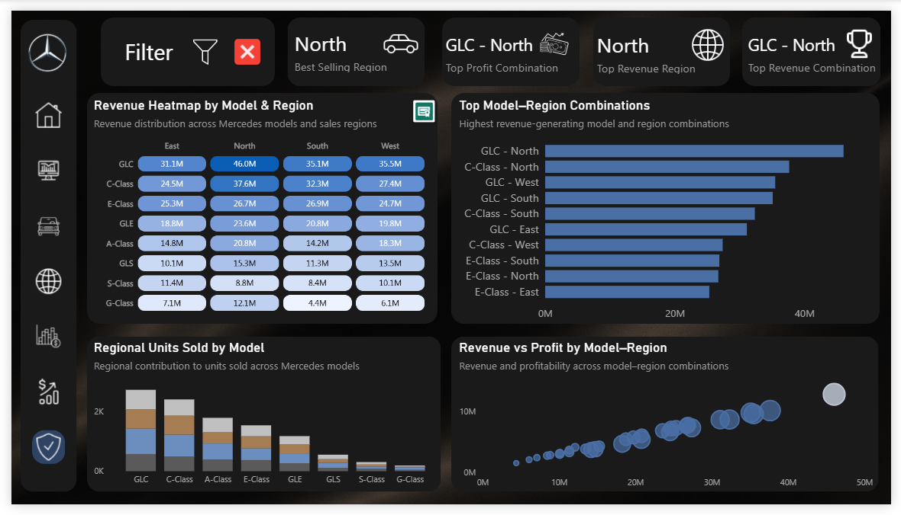

# Mercedes-Benz Sales Analytics

End-to-end analytics project: **Python (ETL) → SQL (analysis) → Power BI (visualization)**.

   

---

## 📊 Overview

This project analyzes Mercedes-Benz sales data across models, regions, and time (2023–2025), following a full analytics pipeline: raw data is cleaned and feature-engineered in Python, loaded into a relational SQLite database, explored through 50+ SQL queries, and finally visualized in a multi-page interactive Power BI dashboard.

The goal is to demonstrate a complete, reproducible analytics workflow — from messy raw data to executive-ready insights — rather than jumping straight to visualization.

---

## 🎬 Demo

**Video walkthrough:** [Watch the demo](videos/Mercedes_Dashboard_Demo_Readme.mp4)

> Note: GitHub only auto-plays inline video if it was uploaded through the GitHub web editor (drag-and-drop into the README edit box), which generates a `user-attachments/assets/...` link. A relative repo path like the one above will show as a clickable download link instead of an inline player — still functional, just not auto-embedded.

| Executive Overview | Model Performance |
|---|---|
|  |  |

| Regional Insights | Profitability Analysis |
|---|---|
|  |  |

| Time Trends | Model × Region Cross-Analysis |
|---|---|
|  |  |

---

## 🗂️ Project Structure

```
Mercedes-Benz-Sales-Analytics/
│
├── image/
│   ├── Cover Page.png
│   ├── Executive Overview.png
│   ├── Model Performance.png
│   ├── Regional Insights.png
│   ├── Profitability Analysis.png
│   ├── Sales Performance.png       # Time Trends page
│   └── Strategic Insights.png      # Model x Region Cross-Analysis page
│
├── videos/
│   └── Mercedes_Dashboard_Demo_Readme.mp4
│
├── data/
│   ├── raw/
│   │   ├── Mercedes_Sales_Data.csv
│   │   └── Mercedes_Sales_Data.xlsx
│   └── cleaned/
│       ├── mercedes_cleaned.csv
│       ├── mercedes.db
│       ├── Sales.csv
│       ├── Models.csv
│       └── Regions.csv
│
├── scripts/
│   ├── etl_pipeline.py
│   └── export_sqlite_tables.py
│
├── sql/
│   └── analysis_queries.sql
│
├── powerbi/
│   └── Mercedes_Sales_Dashboard.pbix
│
├── requirements.txt
├── .gitignore
└── README.md
```

> **Note on filenames:** Several image files above contain spaces (e.g. `Executive Overview.png`). This works with ` `-encoded markdown links (used above), but spaces in filenames are a common source of broken links in git tools, terminals, and other renderers. If you run into issues, renaming to `executive-overview.png` style (no spaces) is more robust — just update the links above to match.

> **Note on page naming:** `Sales Performance.png` and `Strategic Insights.png` correspond to the **Time Trends** and **Model × Region Cross-Analysis** pages respectively (per the Power BI cover page tile names). Consider aligning the cover page tile labels, sidebar, and filenames to use the same names throughout the project for consistency.

---

## 🔧 Pipeline

### 1. ETL (`scripts/etl_pipeline.py`)

**Load**
- Reads raw CSV from `data/raw/Mercedes_Sales_Data.csv`

**Validate**
- Checks for missing values across all columns
- Flags duplicate `Record_ID`s
- Flags negative/zero `Profit` and `Units_Sold`
- Detects price outliers per model using a Z-score threshold (|Z| > 2)

**Clean**
- Removes duplicate `Record_ID`s (keeps first occurrence)
- Drops rows with missing `Price` or `Units_Sold` (required for financial analysis)
- Fills missing `Region` with `"Unknown"` (retained rather than dropped, since region gaps don't affect financial totals)
- Flags — but retains — price outliers, loss-making records, and zero-unit records for downstream analysis rather than silently deleting them

**Feature Engineering**
- `Profit_Margin_Pct` = Profit / Revenue
- `Price_Tier` — 6 price bands from 30K–145K+
- `Unit_Tier` — 5 bands based on units sold per record

**Export**
- Flat cleaned CSV (`mercedes_cleaned.csv`) with Model/Region kept as text for direct Power BI use
- Normalized relational schema exported to SQLite (`mercedes.db`):
  - `Models` (Model_ID, Model)
  - `Regions` (Region_ID, Region)
  - `Sales` (fact table, referencing Model_ID / Region_ID)

### 2. Table Export (`scripts/export_sqlite_tables.py`)
Reads each table (`Sales`, `Models`, `Regions`) back out of `mercedes.db` and exports them individually as CSVs — useful for sharing tables independently or re-importing into other tools.

### 3. SQL Analysis (`sql/analysis_queries.sql`)
50+ queries organized into 12 sections, progressing from basic exploration to advanced analysis:

| Section | Focus |
|---|---|
| 1. Database Exploration | Row counts, table structure, distinct values |
| 2. Join Validation | Verifying Sales ↔ Models ↔ Regions joins |
| 3. Overall Sales Performance | Total revenue, profit, units, avg margin, avg price |
| 4. Model Performance | Revenue/profit/units by model, top 5 models |
| 5. Regional Performance | Revenue/profit/units by region, best/worst regions |
| 6. Model & Region Analysis | Model-region combinations, top/bottom performers per region (window functions) |
| 7. Time-Based Analysis | Revenue by year/month, MoM change (`LAG()`), peak month |
| 8. Price & Unit Tier Analysis | Revenue/profit/margin by price and unit tier |
| 9. Data Quality & Flags | Outlier impact, loss-making record impact, with/without comparisons |
| 10. Advanced Business Questions | Model/region rankings, % revenue contribution, above-average margin models, high-revenue/low-profit models |
| 11. SQL View | Reusable `MODEL_PERFORMANCE` view + ranked query against it |
| 12. Final Validation | Cross-checks totals against Python/Power BI outputs; verifies referential integrity between fact and dimension tables |

### 4. Power BI Dashboard (`powerbi/`)
A 7-page interactive report built on the cleaned data:

1. **Cover Page** — branding and navigation
2. **Executive Overview** — top-line KPIs and trends
3. **Model Performance** — revenue, profit, and units by model
4. **Regional Insights** — revenue, profit, and units by region
5. **Profitability Analysis** — margin, profit contribution, revenue-to-profit ratio
6. **Time Trends** — monthly/quarterly revenue & profit trends, MoM growth
7. **Model × Region Cross-Analysis** — heatmap and top model-region combinations

**Features:** interactive filter panel (Model, Region, Date, Year) with Apply/Reset via bookmarks; consistent region color-coding across all chart types; "Unknown" region retained in tables for transparency but excluded from charts/KPIs to keep visuals focused on primary segments.

---

## 🛠️ Tech Stack

- **Python** — pandas, sqlalchemy (ETL, cleaning, feature engineering)
- **SQLite** — relational storage and SQL analysis
- **SQL** — window functions (`DENSE_RANK`, `LAG`), views, joins, aggregations
- **Power BI** — DAX measures, bookmarks, interactive filtering

See `requirements.txt` for exact Python dependencies.

---

## 🚀 How to Run

1. **Install dependencies**
   ```bash
   pip install -r requirements.txt
   ```

2. **Run the ETL pipeline**
   ```bash
   python scripts/etl_pipeline.py
   ```
   This produces `data/cleaned/mercedes_cleaned.csv` and `data/cleaned/mercedes.db`.

3. **(Optional) Re-export individual tables from SQLite**
   ```bash
   python scripts/export_sqlite_tables.py
   ```

4. **Run SQL analysis**
   Open `sql/analysis_queries.sql` against `data/cleaned/mercedes.db` using any SQLite client (e.g., DB Browser for SQLite, or `sqlite3` CLI).

5. **Open the dashboard**
   Open `powerbi/Mercedes_Sales_Dashboard.pbix` in Power BI Desktop. The report is pre-connected to the cleaned CSV/SQLite output — refresh data source paths if you've moved the project folder.

---

## 📌 Data Notes

- Dataset spans **Jan 2023 – Dec 2025** at the individual sale-record level
- `Region = "Unknown"` represents a small residual category (<0.2% of revenue) — retained throughout the pipeline and in SQL/tables for auditability, but filtered out of Power BI charts and headline KPIs
- Price outliers and loss-making records are **flagged, not removed** — this preserves the ability to analyze their impact (see Section 9 of the SQL analysis) rather than silently altering totals

---

## 📄 License

This project uses synthetic/sample data for demonstration purposes only and is not affiliated with or endorsed by Mercedes-Benz.
